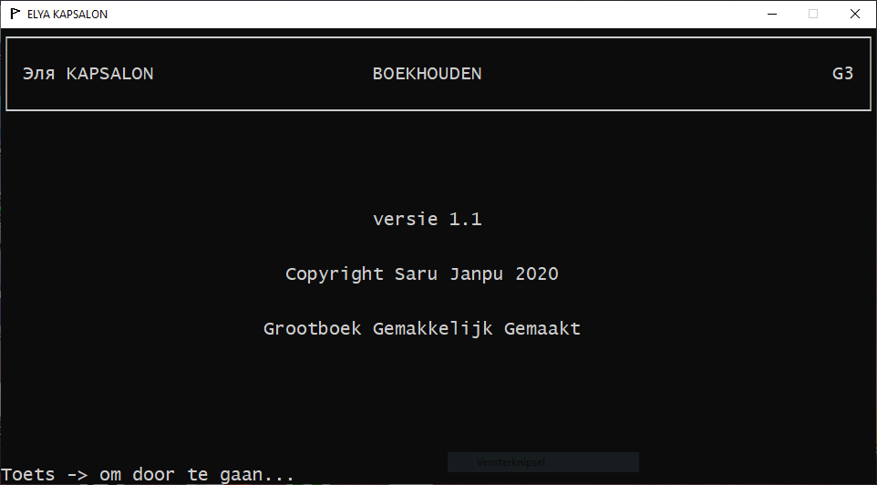

G3
==

Accounting Made Easy

This repository shows an application built in the
[Programming Language Joy](https://github.com/Wodan58/Joy).

Disclaimer
----------

The source code was adjusted to new requirements: UTF-8 strings.
It is now under alpha-testing.

Running
-------

joy g3.joy

Dependencies
------------

[BDW garbage collector](https://github.com/ivmai/bdwgc).

User manual
-----------

See chapters A-Z in:

[User Manual (PDF)](https://github.com/Wodan58/G3/blob/master/JOP.pdf)

Windows installer
-----------------

[G3-JOY-1](https://drive.google.com/file/d/1H8tQwsbWxKky1vSeNMp62w85CX0SPO3T/view?usp=drive_link)

The installer and the program that it installs are 32-bit programs. If, at any
moment in the future, this application is made available in the Microsoft Store,
it will probably be 64-bit.

See also
--------

[GnuCash](https://www.gnucash.org)

History
-------

This application is a reincarnation of a BASIC program developed by a reverend
in 1985. Whether this application bears any visual resemblance to the original
is unbeknownst to the current maintainer.

Splash
------

 
