 
==============

Introduction
============

Instead of downloading and compiling the source code of Joy, it should be
possible to present an installer for the Windows operating system.

Such an installer can be created with Visual Studio 2022, but using the
installer proved to be a frightening experience.

The many steps that are needed are shown in pictures.

Installation
============

The first step is building the joy.exe binary. This can be done in busybox,
using the tiny C compiler. The result is shown in this picture.

 

Instead of the many sections that the gcc compiler generates, this one has
only .text and .data. That is more like Joy. It is a 32-bits binary, usable
on almost any Windows version. The 64-bits binary has one more section,
containing read-only data.

As this is a binary for the Windows system, it is possible to add an Icon that
will be displayed here and there. ResourceHacker can be used to add that Icon
and the result is shown here.

 

There are two possible ways to download: directly from the G-drive or through
a link in the browser. The first method is presented here and the latter will
be presented later on.

 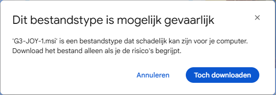

The text warns that an .msi file can be dangerous and downloading should only
be done if the user understands the risks. There is disagreement possible:
an .msi file is a kind of .zip file that does nothing, if it is only downloaded.

 

After downloading there is another warning, telling that this particular file
is unknown and should only be opened, when trusted.

 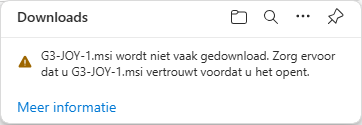

The way to open it, is to click on the ellipsis next to the message. This
causes the Microsoft Defender to give a warning that it cannot check whether
the file is save to be used.

 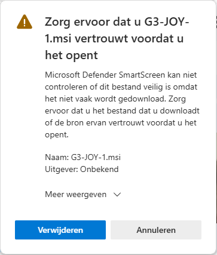

The only way to proceed is to press on the text that says: display more.
That gives the same text again and offers the possibility to keep the file.

 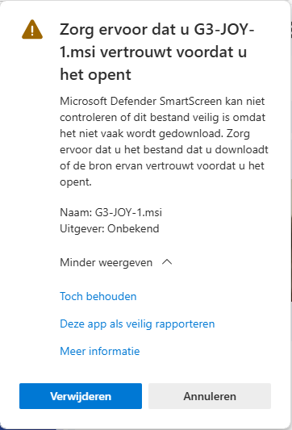

Then the Windows installer is triggered, the program that takes the .msi file
and installs the software. The message shown here tells that the program has
already been installed. That means that the previous version must be removed
first. This is a standard Windows operating procedure, not shown here.

 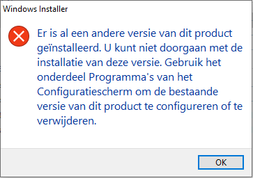

And then the virus scanner prevents further installation. The only way to get
around this is to disable the virus scanner, but that is not all. More about
this later on.

The second method is to follow a direct link to the Google Drive, where the
installer is located and download it from there. That gives the following
picture:

 

Google does not know how to display the contents. That is ok, the contents of
an .msi file is quite complicated.

The next step is to press the download key and that leads to the following
screen, that says that the .msi is an executable and can harm the computer.
Again, an .msi file is a kind of .zip file. It can contain executables, but
it is itself not an executable.

 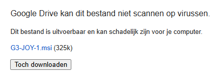

And then the virus scanner kicks in, preventing the download.

 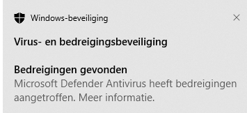

As stated before, the only way to download the file, is to first disable the
virus scanner. It can be enabled later on, after the installation is completed.

The next message comes from the Microsoft installer that says that the PC is
protected and offers to not continue.

 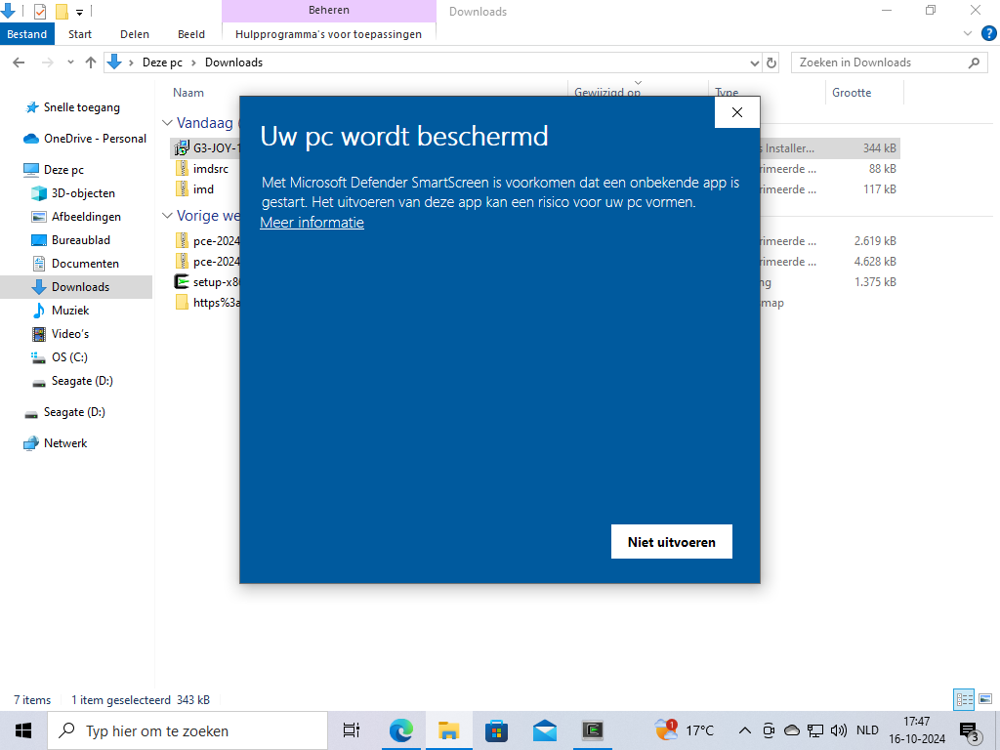

The only way to continue is to press on the text that offers more information.

 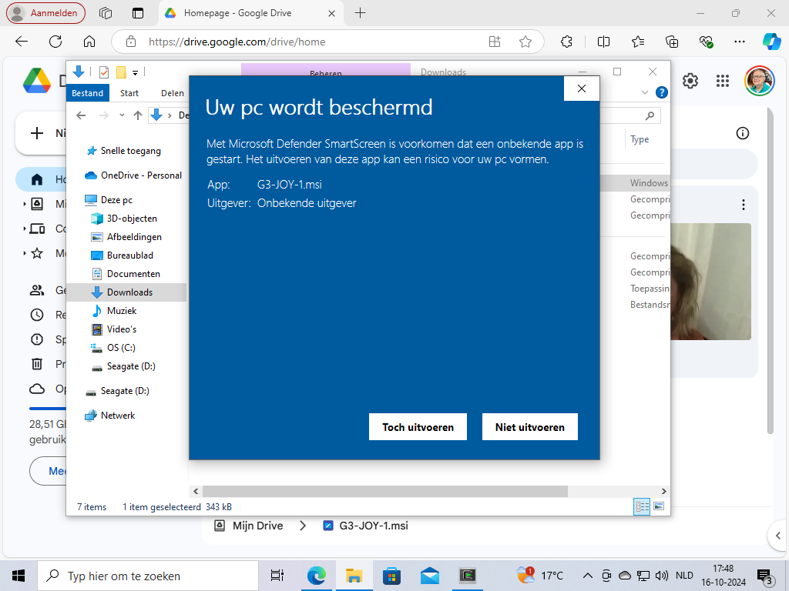

It says that the .msi file is from an unknown publisher. That, of course, is
not true. The publisher is mentioned in the .msi file. What is meant is that
the .msi file has not been signed by a verified company. Pressing on the left
button finally starts the installation.

 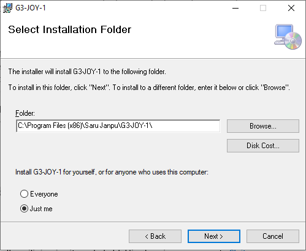

The installation is in English, not the local language. It is possible to
change the location. The standard location starts with "Program Files (x86)",
because it is a 32-bit binary that is included in the .msi file. On a 32-bit
Windows system, the location would be just "Program Files". There are two
subdirecties here, but that does not really matter, as the shortcut that will
be created points to the correct installation directory.

 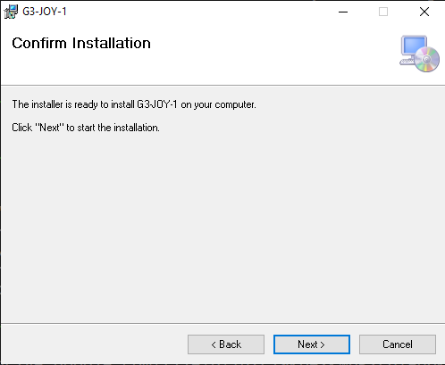

The next step still offers the possibility not to install the software. Having
gone this far, it might as well be best to proceed. Installing is still
harmless, as it only copies files from the .msi file to the installation
directory. Nothing is actually executed.

 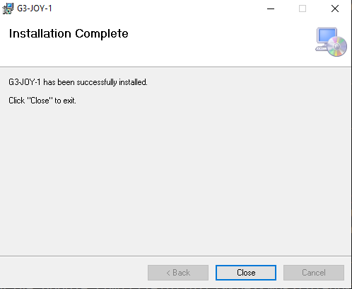

Finally, the last screen of the installation. The installation directory is now
filled and can be inspected in order to see what it has to offer.

 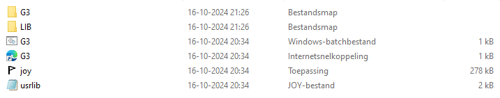

There is a batch file that starts the G3 application, there is an internet
link to the G3 repository on Github, where some documentation is located,
there is the Joy binary and there is usrlib.joy, the initial library file.

 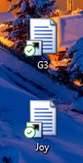

On the desktop, two links have been created, one points to the G3 batch file,
the other points to the Joy binary.

The links themselves are not very interesting. They mention the working
directory, currently the Desktop.

What is interesting is that through the Joy link, Joy can be started.

 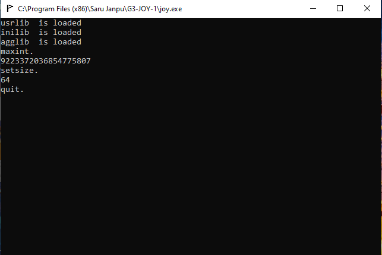

As stated before, it is a 32-bit binary. Even so, it supports 64-bit
computation, why not. 64-bit is now the standard. But this is not the end
of the story. The virus scanner was disabled, and needs to be enabled again.

After doing so, when starting Joy again, the virus scanner kicks in and
prevents execution of Joy and the file is removed.

 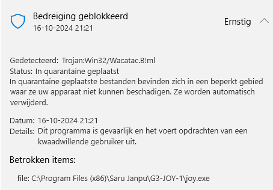

So, in order to make the installation complete, the Joy binary must be
registered as an exception to the virus scanner. And the installation must
be done again, because the Joy binary was deleted by the virus scanner.

 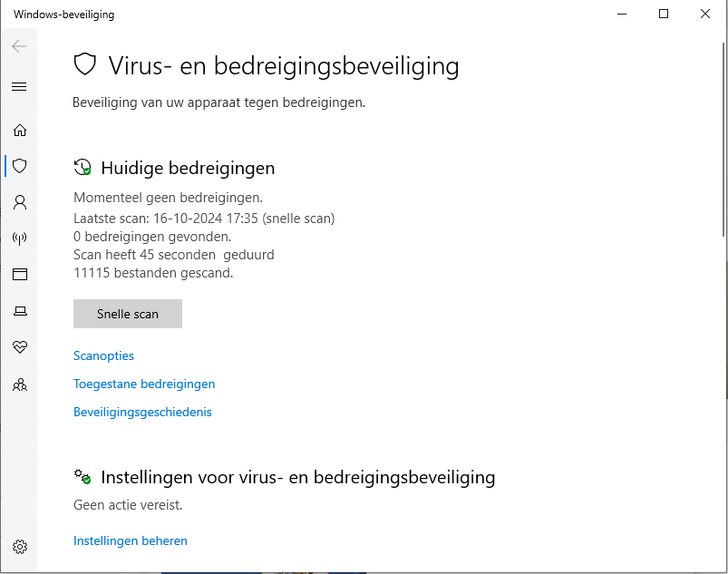

The virus scanner is now satisfied.

Conclusion
==========

Because of the many difficulties with installing from a download link,
the advice is to just download the sources, install a C compiler and
continue from there.

Compilation with tcc means that the makefile needs to be adjusted:
tcc instead of gcc and the -lm in the linker flags can be removed.

Tcc links with msvcrt.dll, that is present on all Windows systems.
